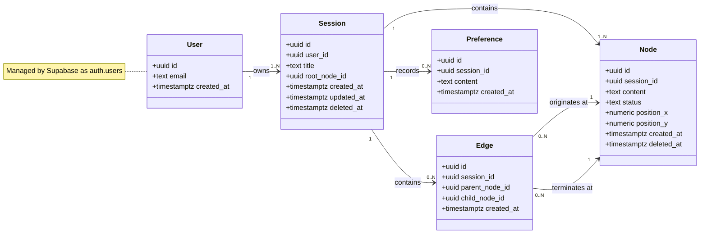

# Data model

This file holds the class diagram for Pathfinders along with the
reasoning behind it. The diagram is below, and the same thing is
kept in docs/data-model.drawio for editing with an exported copy
in docs/data-model.png. Cole is building the Supabase migration
in #29 from what is written here, so if the schema and this file
ever disagree, this file is the one that needs correcting.

Additionally, you can find a picture of the graph @
[here](uml-data-model.png)

## What we store

There are five entities, although only four of them are ours to
define. User is one person, which Supabase creates and manages
on our behalf as auth.users. Session is one brainstorm, meaning
one canvas. Node is one box on that canvas, holding one idea.
Edge is one line between two boxes, recording that the idea at
one end came out of the idea at the other. Preference is a
standing instruction that holds for the rest of a session, such
as keeping every suggestion low budget.

Session to Edge is marked 0..N rather than 1..N because a
session that has just been created holds a root node and nothing
else, so there is a real state in which it has no edges at all.

## Why connections are their own entity

The simpler design would give Node a parent_id column, which is
perfectly adequate for a tree and is what I think we would have
settled on if US-12 were out of scope. However, merging two
nodes leaves the resulting node with two parents, and a single
column holds a single value, so the structure has to be a graph
rather than a tree and connections have to become rows of their
own.

The second reason is that the two possible mistakes are not
equally expensive. Building the Edge entity and later dropping
merge costs us one table and one join, whereas building
parent_id and later adding merge costs us the schema along with
every query that reads the graph. Given that asymmetry, I think
the extra table is worth paying for even in the case where merge
ends up postponed.

One consequence is worth recording here: Postgres will not stop
a cycle from being created through the Edge table, so cycle
prevention has to be an application-level rule living in the
data access layer (#30).

## Why the opening prompt is a node

We could have stored the user's opening prompt as a root_prompt
column on Session and let Node hold only the ideas the model
generates. Instead the root is an ordinary node with nothing
pointing at it, which keeps every box on the canvas the same
kind of object: the canvas needs no special case for drawing the
prompt, and expanding the root behaves exactly as expanding
anything else does. The cost is that finding the root means
looking for the node with no incoming edge, which is the reason
Session carries a root_node_id column as a shortcut.

## The smaller decisions

Positions sit on Node as nullable columns. Storing them is
necessary for anything where a user drags a node and expects it
to stay where they put it, and leaving them nullable means a
computed layout can ignore them at no cost, whereas adding them
later would mean a migration and a backfill for every node
already in the table.

Preferences are scoped to a session rather than to a user,
because that is what US-08 asks for. Widening the scope later is
a matter of adding a column, although narrowing it later would
mean untangling rows that had been shared between brainstorms
which were never meant to share anything.

Node and Session both carry a deleted_at column, since US-07
asks for "delete/deactivate" rather than deletion alone, and
deactivation is a state that has to be stored somewhere.
Deleting a node also removes everything beneath it, which on its
own is reason enough to keep the operation reversible.

Edge carries a session_id column even though both of the nodes
it connects already know their session. The redundancy is
deliberate: it lets the row-level security policy on Edge
establish ownership in one step instead of joining through Node
to reach Session, at the cost of keeping that column consistent
in the data access layer.

## What we left out

There is no share or token entity, since US-10 and US-11
describe export and import through a file, and a file requires
nothing to be persisted. A shareable link would need one, and I
think that should be treated as a schema change rather than a
small addition.

There is no separate entity for accepting and rejecting nodes,
because US-05 asks only for the current state of a node and not
for a record of every decision made over time, which a status
column covers. A history of those decisions would be its own
entity.

There is also no entity for naming branches. US-09 renames a
session, which the title column on Session already handles, and
nothing in our user stories asks for a branch to be named
independently of the node it grows out of.

## Still open

The position columns depend on what Jonah settles on in #33, so
if the canvas ends up computing layout instead of storing it,
this file needs a note saying as much. Additionally,
deleteSubtree in #30 needs a defined answer for the case where
the node being deleted has a descendant that was merged out of
two branches: I think the shared child should survive as long as
its other parent is still alive, although that has not been
agreed on yet.

## AI usage

I used Claude to pressure-test this model, mainly on the
tree-versus-graph question and on whether anything in our user
stories had no home in the schema, which is how the deleted_at
columns came to be added. The decisions and this write-up are
ours.
